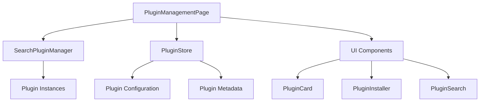

# Design Document

## Overview

The plugin management page will be a comprehensive interface for managing search plugins in the application. It will extend the existing plugin architecture by providing enhanced UI components for plugin discovery, installation, configuration, and lifecycle management. The design leverages the existing `SearchPluginManager` and integrates seamlessly with the current Vue 3 + TypeScript + Tauri architecture.

## Architecture

### Component Structure

```
PluginManagementPage.vue (New)
├── PluginCard.vue (New)
│   ├── PluginHeader.vue (New)
│   ├── PluginSettings.vue (Enhanced from existing)
│   └── PluginActions.vue (New)
├── PluginInstaller.vue (New)
├── PluginSearch.vue (New)
└── PluginStats.vue (New)
```

### Data Flow



### Integration Points

- **Router Integration**: Add new route `/plugins` to the existing router configuration
- **Plugin Manager**: Extend existing `SearchPluginManager` with additional metadata and lifecycle methods
- **Settings Integration**: Enhance existing settings system to include plugin management preferences
- **UI Components**: Utilize existing shadcn/ui components for consistent design language

## Components and Interfaces

### 1. Enhanced Plugin Interface

```typescript
interface EnhancedSearchPlugin extends SearchPlugin {
  // Existing properties from SearchPlugin
  metadata: PluginMetadata
  installation: PluginInstallation
  permissions: PluginPermissions[]
}

interface PluginMetadata {
  author: string
  homepage?: string
  repository?: string
  license: string
  keywords: string[]
  installDate: Date
  lastUpdated: Date
  fileSize: number
  dependencies: string[]
}

interface PluginInstallation {
  isInstalled: boolean
  isBuiltIn: boolean
  installPath?: string
  canUninstall: boolean
}

interface PluginPermissions {
  type: 'filesystem' | 'network' | 'system' | 'clipboard'
  description: string
  required: boolean
}
```

### 2. Plugin Management Service

```typescript
class PluginManagementService {
  async getAvailablePlugins(): Promise<PluginCatalogItem[]>
  async installPlugin(pluginId: string): Promise<void>
  async uninstallPlugin(pluginId: string): Promise<void>
  async updatePlugin(pluginId: string): Promise<void>
  async getPluginDetails(pluginId: string): Promise<EnhancedSearchPlugin>
  async searchPlugins(query: string): Promise<PluginCatalogItem[]>
  async validatePlugin(pluginPath: string): Promise<PluginValidationResult>
}
```

### 3. Main Plugin Management Page Component

```typescript
// PluginManagementPage.vue
interface PluginManagementPageState {
  installedPlugins: EnhancedSearchPlugin[]
  availablePlugins: PluginCatalogItem[]
  searchQuery: string
  selectedCategory: PluginCategory
  isLoading: boolean
  selectedPlugin: EnhancedSearchPlugin | null
}
```

### 4. Plugin Card Component

```typescript
// PluginCard.vue
interface PluginCardProps {
  plugin: EnhancedSearchPlugin
  showActions: boolean
  compact: boolean
}

interface PluginCardEmits {
  'toggle-enabled': (pluginId: string, enabled: boolean) => void
  'configure': (pluginId: string) => void
  'uninstall': (pluginId: string) => void
  'view-details': (pluginId: string) => void
}
```

## Data Models

### Plugin Catalog

```typescript
interface PluginCatalogItem {
  id: string
  name: string
  description: string
  version: string
  author: string
  category: PluginCategory
  tags: string[]
  downloadUrl: string
  homepage?: string
  screenshots: string[]
  rating: number
  downloadCount: number
  lastUpdated: Date
  minAppVersion: string
  permissions: PluginPermissions[]
}

enum PluginCategory {
  SEARCH = 'search',
  PRODUCTIVITY = 'productivity',
  UTILITIES = 'utilities',
  DEVELOPMENT = 'development',
  SYSTEM = 'system'
}
```

### Plugin Configuration Schema

```typescript
interface PluginConfigurationSchema {
  version: string
  settings: PluginSettingDefinition[]
  actions: PluginActionDefinition[]
}

interface PluginSettingDefinition {
  key: string
  type: 'string' | 'number' | 'boolean' | 'select' | 'multiselect' | 'file' | 'directory'
  label: string
  description?: string
  defaultValue: any
  required: boolean
  validation?: PluginSettingValidation
  options?: PluginSettingOption[]
  dependsOn?: string
}
```

## Error Handling

### Error Types

```typescript
enum PluginErrorType {
  INSTALLATION_FAILED = 'installation_failed',
  UNINSTALLATION_FAILED = 'uninstallation_failed',
  CONFIGURATION_ERROR = 'configuration_error',
  PERMISSION_DENIED = 'permission_denied',
  NETWORK_ERROR = 'network_error',
  VALIDATION_ERROR = 'validation_error',
  DEPENDENCY_ERROR = 'dependency_error'
}

interface PluginError {
  type: PluginErrorType
  message: string
  details?: string
  pluginId?: string
  recoverable: boolean
  suggestedAction?: string
}
```

### Error Handling Strategy

1. **User-Friendly Messages**: Convert technical errors into actionable user messages
2. **Graceful Degradation**: Continue operation when non-critical plugins fail
3. **Recovery Options**: Provide clear steps for error resolution
4. **Logging**: Comprehensive error logging for debugging
5. **Rollback**: Automatic rollback for failed installations/updates

## Testing Strategy

### Unit Testing

```typescript
// Plugin Management Service Tests
describe('PluginManagementService', () => {
  test('should install plugin successfully')
  test('should handle installation failures gracefully')
  test('should validate plugin permissions')
  test('should uninstall plugin and clean up resources')
})

// Plugin Card Component Tests
describe('PluginCard', () => {
  test('should display plugin information correctly')
  test('should emit events on user interactions')
  test('should show/hide actions based on plugin state')
})
```

### Integration Testing

```typescript
// Plugin Lifecycle Tests
describe('Plugin Lifecycle Integration', () => {
  test('should install, enable, configure, and uninstall plugin')
  test('should persist plugin settings across app restarts')
  test('should handle plugin conflicts and dependencies')
})
```

### E2E Testing

```typescript
// User Journey Tests
describe('Plugin Management User Journey', () => {
  test('user can browse and install plugins')
  test('user can configure plugin settings')
  test('user can enable/disable plugins')
  test('user can uninstall plugins')
})
```

## UI/UX Design Patterns

### Layout Structure

```
┌─────────────────────────────────────────────────────────────┐
│ Plugin Management Header                                     │
├─────────────────────────────────────────────────────────────┤
│ Search Bar | Category Filter | Sort Options                 │
├─────────────────────────────────────────────────────────────┤
│ ┌─────────────┐ ┌─────────────┐ ┌─────────────┐            │
│ │ Plugin Card │ │ Plugin Card │ │ Plugin Card │            │
│ │             │ │             │ │             │            │
│ └─────────────┘ └─────────────┘ └─────────────┘            │
│                                                             │
│ ┌─────────────┐ ┌─────────────┐ ┌─────────────┐            │
│ │ Plugin Card │ │ Plugin Card │ │ Plugin Card │            │
│ │             │ │             │ │             │            │
│ └─────────────┘ └─────────────┘ └─────────────┘            │
├─────────────────────────────────────────────────────────────┤
│ Plugin Statistics | Bulk Actions                           │
└─────────────────────────────────────────────────────────────┘
```

### Visual Design Principles

1. **Consistency**: Use existing design tokens and component library
2. **Clarity**: Clear visual hierarchy and information architecture
3. **Accessibility**: WCAG 2.1 AA compliance with proper ARIA labels
4. **Responsiveness**: Adaptive layout for different screen sizes
5. **Performance**: Lazy loading and virtualization for large plugin lists

### Interaction Patterns

- **Hover States**: Subtle elevation and color changes
- **Loading States**: Skeleton screens and progress indicators
- **Empty States**: Helpful illustrations and call-to-action buttons
- **Confirmation Dialogs**: Clear consequences and action buttons
- **Toast Notifications**: Success/error feedback with auto-dismiss

## Performance Considerations

### Optimization Strategies

1. **Virtual Scrolling**: For large plugin lists (>100 items)
2. **Lazy Loading**: Load plugin details on demand
3. **Caching**: Cache plugin metadata and search results
4. **Debounced Search**: Prevent excessive API calls during typing
5. **Progressive Enhancement**: Core functionality works without JavaScript

### Memory Management

```typescript
// Plugin instance lifecycle management
class PluginInstanceManager {
  private instances = new Map<string, SearchPlugin>()
  private cleanupTasks = new Map<string, () => void>()
  
  async loadPlugin(pluginId: string): Promise<SearchPlugin>
  async unloadPlugin(pluginId: string): Promise<void>
  cleanup(): void
}
```

## Security Considerations

### Plugin Validation

1. **Code Signing**: Verify plugin authenticity
2. **Permission System**: Granular permission controls
3. **Sandboxing**: Isolate plugin execution
4. **Content Security Policy**: Prevent XSS attacks
5. **Input Validation**: Sanitize all user inputs

### Data Protection

1. **Secure Storage**: Encrypt sensitive plugin data
2. **Network Security**: HTTPS for all plugin downloads
3. **Privacy**: Clear data collection policies
4. **Audit Trail**: Log all plugin management actions

## Accessibility Features

### WCAG 2.1 AA Compliance

1. **Keyboard Navigation**: Full keyboard accessibility
2. **Screen Reader Support**: Proper ARIA labels and descriptions
3. **Color Contrast**: Minimum 4.5:1 contrast ratio
4. **Focus Management**: Clear focus indicators and logical tab order
5. **Alternative Text**: Descriptive alt text for all images

### Assistive Technology Support

```typescript
// Accessibility utilities
interface AccessibilityProps {
  'aria-label': string
  'aria-describedby'?: string
  'role'?: string
  'tabindex'?: number
}
```